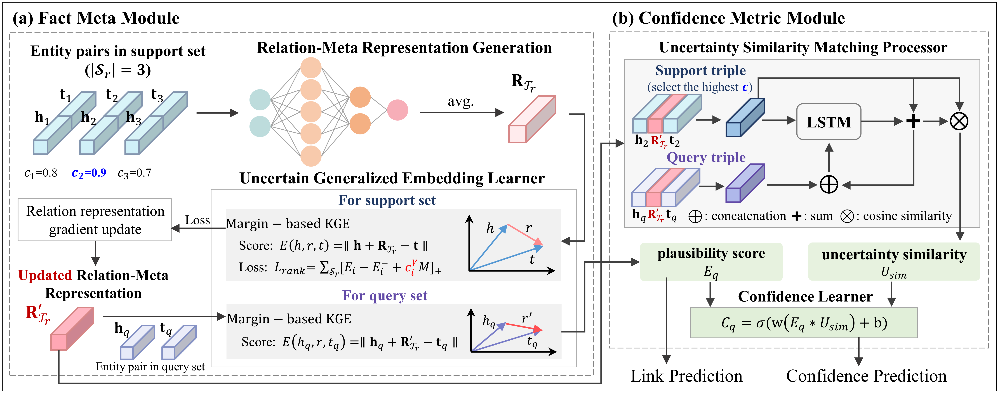

# MMUC: a Meta-Metric Learning Framework for Few-Shot Uncertain Knowledge Graph Completion

### Overview



### Requirements

- Python 3.6.5
- PyTorch 1.10.1

### Usage

```
python main.py
```

The current hyperparameter default is the same setting we use in this paper.


### Reference

The public dataset used in this paper comes from [GMUC](https://github.com/zhangjiatao/GMUC).

